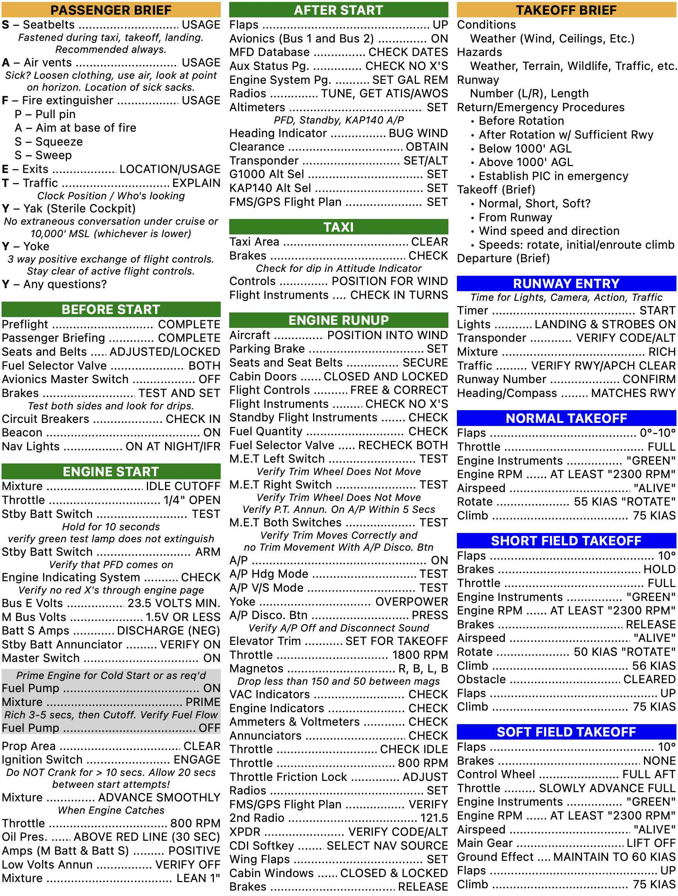

# Checklists

This repository holds checklists, written in HTML/CSS, and additional configuration and script to generate a PDF from the source.
The generated PDF has a pagesize of 8.5 x 11 inches, with the checklist approximately 6.5 x 8.75 inches, a size which works well with many pilot kneeboards.
A sample output PDF can be found in `./sample/sample.pdf`.
Currently this repository contains 9 unique checklists for various aircraft/avionics configurations.
The Makefile is written to generate a single PDF output for each aircraft directory in `src`.
The post [Generating Aviation Checklists with Make](https://danielwiese.com/posts/makefile-checklists/) provides some additional information as to why and how this approach to checklist generation was chosen.

*Disclaimer: you are responsible for the safe operation of your aircraft - these checklists are provided for reference only. Consult and use only FAA-approved POH/AFM/supplements and other material when flying. No liability of any kind is assumed should the contents of this repository be used in any way.*

<p align="center">
  
</p>

## Generating Output

```sh
# To make all the checklists from source
make all
```

## Developing

Adding a new aircraft should be very straightforward: just copy and rename an existing aircraft directory within `src`, and modify the HTML as desired.
When running Make, the corresponding PDF will automatically be generated.

Optionally, for the purposes of viewing changes to generated PDFs, consider [diff-pdf](https://vslavik.github.io/diff-pdf/).

```sh
# Check diffs between two checklists
diff-pdf --output-diff=diff.pdf c172m-g5-mph.pdf c172m-g5-surefire.pdf
```

## TODO

The following note tracks a warning I have not yet looked into fixing.

```sh
weasyprint --version
# WeasyPrint version 60.1

pandoc --version
# pandoc 3.1.7
# Features: +server +lua
# Scripting engine: Lua 5.4
# User data directory: /Users/dpwiese/.pandoc
```

Seeing following error when compiling each checklist.
[WeasyPrint/issues/1739](https://github.com/Kozea/WeasyPrint/issues/1739) shows an output from a user who received the same error, but need to look closer if it's even related.
Generated PDFs seem correct.

```sh
WARNING: Ignored `gap: min(4vw, 1.5em)` at 4:32, unknown property.
WARNING: Ignored `overflow-x: auto` at 5:28, unknown property.
```
